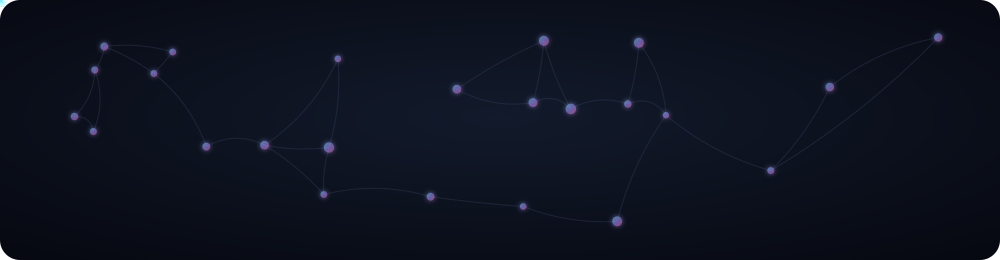
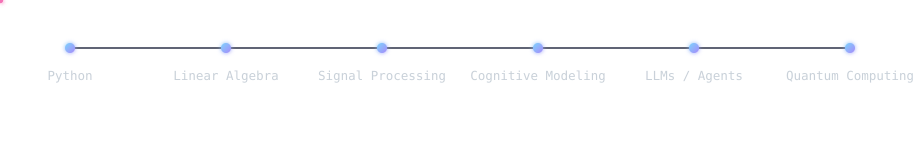

 

### who i am

I'm Rishi — an 19-year-old solo builder working where cognitive science, AI, and quantum computing overlap. No lab, no cofounder, no formal program behind me — just a notebook full of half-finished theories and a habit of shipping the parts that work.

I think in cross-domain leaps rather than single tracks — closer to how da Vinci moved between anatomy, mechanics, and art than how most engineers move between tickets. Math and physics are where my curiosity actually lives; code is just the fastest tool I've found for turning an idea into something that runs.

Most of what I build starts from the same question: **what does it look like to actually model a mind — a person's specific way of thinking — instead of a generic dataset?**

 

 

### what i'm building

**[Yentellect](https://yentellect.vercel.app)** — a cognitive training platform built around the idea of a personal *cognitive fingerprint*: how you specifically reason, where you specifically get stuck, and what training actually expands that. This is the long-term bet.

**Conceptual SuperIntelligence** — a framework I'm formalizing that treats intelligence as a combinatorial function of three things: the reality model an agent holds, the information it has access to, and the mechanism it uses to combine them. Manifesto in progress.

**[Civilens](https://curios-azure.vercel.app/)** — an interactive WebGL/MapLibre GL civilization explorer with an AI synthesis layer on top, for exploring how human settlements and systems evolve spatially over time.

**Open source (Python):**
- [`Pocket Companion`](https://github.com/rishibagale/pocket-companion) — fully offline voice AI using `faster-whisper` + Ollama
- `TwinBot` — a personal AI replica with multi-channel adapters and persistent SQLite memory
- `Yentofi v0.1` — an early agent loop with Socratic session design, built on the Groq API

 

### connect

 

<i>"Imagination is more important than the imitation of what already exists."</i>

 

